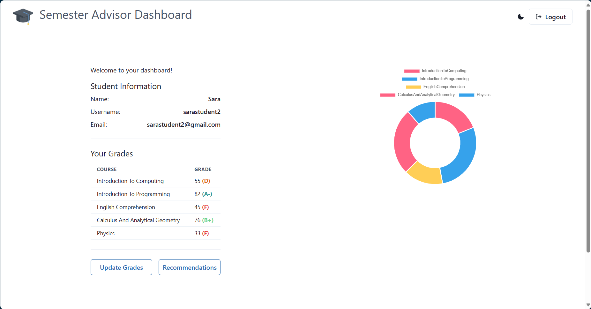
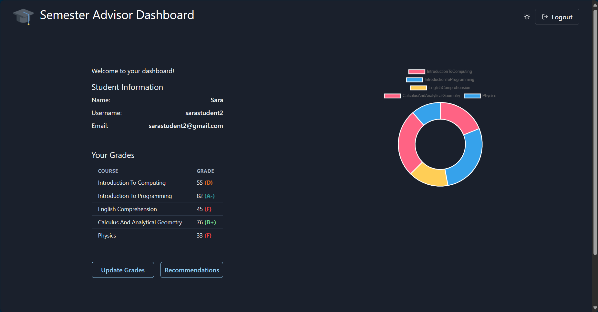

# Semester Advisor Frontend

Welcome to the Semester Advisor Frontend repository! This frontend application is designed to provide students with personalized recommendations for their upcoming semesters based on their academic performance and preferences.

The backend of the project can be found at [this link](https://github.com/ahmadthakur/semester-advisor-backend).




## Table of Contents

- [Getting Started](#getting-started)
  - [Prerequisites](#prerequisites)
  - [Installation](#installation)
- [Usage](#usage)

## Getting Started

### Prerequisites

Before you begin, ensure you have the following installed:

- [Node.js](https://nodejs.org/)
- [npm](https://www.npmjs.com/) (comes with Node.js)

### Installation

1. Clone the repository:

   ```bash
   git clone https://github.com/ahmadthakur/semester-advisor-frontend.git
   ```

2. Navigate to the project directory:

   ```bash
   cd semester-advisor-frontend
   ```

3. Install dependencies:
   ```bash
   npm install
   ```

## Usage

To start the development server, run:

```bash
npm run start
```
